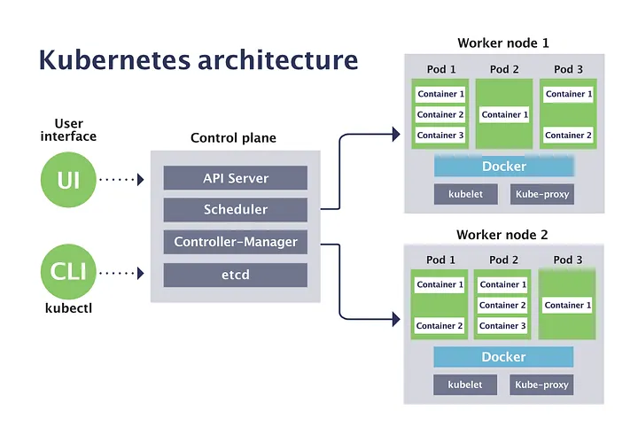

3. Core Kubernetes Objects:
===========================

Pod → smallest unit (your app)
==============================

    1. A Pod is the smallest and most important unit in Kubernetes.
    2. Kubernetes does not run containers directly, it runs containers inside a Pod.
    Note: Pod is the smallest deployable unit in Kubernetes, which contains one or more containers with shared network and shared storage.

Shared Network in Pod:
---------------------

    In Kubernetes, all containers inside the same Pod share the same network.

    That means:

        ✅ They share the same IP address

        ✅ They share the same port space

        ✅ They can communicate using localhost

Note: Shared network means all containers in a Pod share the same IP and can communicate with each other using localhost.

Shared Storage in Pod:
------------------------

    All containers inside the same Pod can share the same storage volume.

    So if one container writes data into the volume, the other container can read it.

        ✅ Types of Shared Storage in Pod

            1️⃣ emptyDir

            temporary storage

            deleted when pod is deleted

            2️⃣ Persistent Volume (PV + PVC)

            permanent storage

            data remains even after pod restart

Note: Shared storage means all containers inside a Pod can access the same volume to share files and data.

Persistent Volume (PV) and Persistent Volume Claim (PVC) are used for permanent storage

    🔹 Persistent Volume (PV)

        PV is the actual storage resource.

    🔹 Persistent Volume Claim (PVC)

        PVC is a request for storage.

        Kubernetes will search and connect the PVC to a matching PV.

Note: PV is the real storage created in the cluster, and PVC is the storage request created by the user. PVC binds with PV and then pod uses that storage.

ReplicaSet → ensures number of pods
=====================================

A ReplicaSet is a Kubernetes object used to make sure that a fixed number of Pod replicas are always running.

In simple words:

👉 ReplicaSet ensures high availability by maintaining required pods.

✅ What ReplicaSet Does?

If you set replicas = 3, ReplicaSet will ensure:

✅ 3 pods are always running

If one pod crashes or gets deleted:

➡️ ReplicaSet automatically creates a new pod.

So it provides self-healing.

✅ Important Note (Interview Point)

Normally we do not create ReplicaSet directly.

Instead, we create a Deployment, and Deployment automatically creates ReplicaSet.

So flow is:

Deployment → ReplicaSet → Pods

Note: ReplicaSet is a Kubernetes controller that maintains the desired number of pod replicas and automatically creates new pods if any pod fails or is deleted.

Deployment → manages updates (rollout/rollback)
=================================================
    Deployment is a Kubernetes object used to manage applications by creating ReplicaSets and Pods, and it supports scaling, rolling updates, self-healing, and rollback.

✅ What Deployment Does?
    🔹 1. Creates ReplicaSet

    Deployment will automatically create a ReplicaSet.

    🔹 2. ReplicaSet Creates Pods

    ReplicaSet ensures required number of pods are running.

So the flow is:

    Deployment → ReplicaSet → Pods

✅ What Deployment Does?
🔹 1. Creates ReplicaSet

Deployment will automatically create a ReplicaSet.

🔹 2. ReplicaSet Creates Pods

ReplicaSet ensures required number of pods are running.

So the flow is:

Deployment → ReplicaSet → Pods
✅ Main Features of Deployment
✅ 1. Scaling

If you want more pods:

replicas = 2 → replicas = 5

Deployment increases pods automatically.

✅ 2. Rolling Update

If you update application version (image update):

Deployment will update pods one by one, without downtime.

Example:

nginx:1.0 → nginx:2.0
✅ 3. Rollback

If new version fails:

Deployment can rollback to old stable version.

✅ 4. Self-Healing

If any pod crashes:

ReplicaSet recreates pod automatically.

Note: Deployment is a Kubernetes object used to manage applications by creating ReplicaSets and Pods, and it supports scaling, rolling updates, self-healing, and rollback.

Service → exposes pods (ClusterIP, NodePort, LoadBalancer)
===========================================================

    A Service in Kubernetes is used to provide a stable network access to Pods.

    Because Pods are not permanent.
    If a Pod restarts, its IP address will change.

✅ Types of Services

    1️⃣ ClusterIP (Default)

        ClusterIP is the default type of Kubernetes Service.

        It provides a stable internal IP address to access Pods only inside the Kubernetes cluster.

    Note: ClusterIP is the default Kubernetes service type which exposes the application internally inside the cluster using a stable IP and DNS name.

        Internal access only
        Used inside cluster

    2️⃣ NodePort

        NodePort is a type of Kubernetes Service used to expose an application outside the cluster.

        It opens a specific port on every worker node, so external users can access the application using:

        👉 NodeIP : NodePort

        Opens port on worker node
        External access using:
        NodeIP:NodePort

        Note: NodePort is a Kubernetes service type that exposes the application externally by opening a port on every worker node, and users can access it using NodeIP and NodePort.

    3️⃣ LoadBalancer
        LoadBalancer is a Kubernetes Service type used to expose an application to the outside world (internet) using a cloud load balancer.

        It is mostly used in cloud platforms like:

        ✅ AWS (ELB/ALB)
        ✅ Azure
        ✅ GCP

        ✅ How LoadBalancer Works?

        When you create a Service with type LoadBalancer:

            Kubernetes creates a Service
            Cloud provider automatically creates an External Load Balancer
            It assigns a Public IP / DNS
            Traffic goes to worker nodes
            Then service forwards to pods

        Creates cloud load balancer
        Used in AWS / Azure / GCP

    Note: LoadBalancer is a Kubernetes service type that exposes the application externally by creating a cloud load balancer and provides a public IP or DNS to access the application.

    4️⃣ ExternalName
    Maps service to external DNS name
Ingress → HTTP/HTTPS routing
ConfigMap → non-sensitive config
Secret → sensitive data (passwords, tokens)