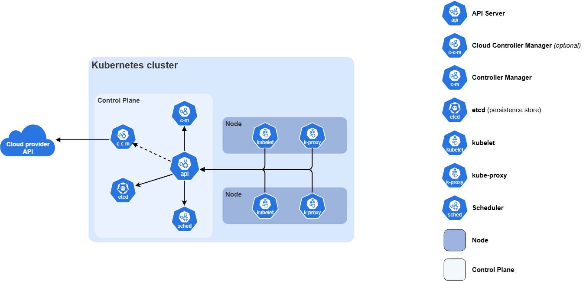

Kubernetes Architecture
=========================

Kubernetes has two main parts:

    1) Control Plane (Master) → Brain of the cluster
    2) Worker Nodes → Where your applications actually run

Kubernetes architecture is mainly divided into two parts:
==========================================================

1) Control Plane (Master Node)

    The control plane is the brain of Kubernetes. It manages the cluster and decides what should run where.

    Key Control Plane Components:

1. API Server (kube-apiserver)

This is the main entry point of Kubernetes.
All requests from users, kubectl, or CI/CD tools go through the API server.
So API server accepts all requests and gives responses.

2. etcd

It is a key-value database.
Stores the complete cluster information like pods, nodes, configs, secrets, deployments, etc.

3. Scheduler (kube-scheduler)

It decides on which worker node the pod should run.
It checks CPU, memory, node availability, and resource requirements.

Example:
If pod needs CPU and memory, scheduler checks all worker nodes and selects the best node.

So scheduler is responsible for pod placement.

4. Controller Manager (kube-controller-manager)

It ensures the desired state matches the actual state.
Example: if a pod crashes, it creates a new pod automatically.

Example:
If I want 3 pods, but only 2 pods are running, controller manager will create 1 more pod.

So controller manager maintains desired state.

5. Cloud Controller Manager (optional)

Used when Kubernetes runs in cloud like AWS, Azure, GCP.
It manages cloud resources like Load Balancers, volumes, and networking.
2) Worker Nodes

Worker nodes are the machines where applications actually run.

Worker Node Components:

1. Kubelet

It is an agent running on every worker node.
It communicates with API server and ensures pods are running properly.

2. Container Runtime

Example: Docker, containerd, CRI-O
It is responsible for running containers inside pods.

3. Kube-proxy

Handles networking and load balancing inside the cluster.
It manages services and routes traffic to correct pods.

